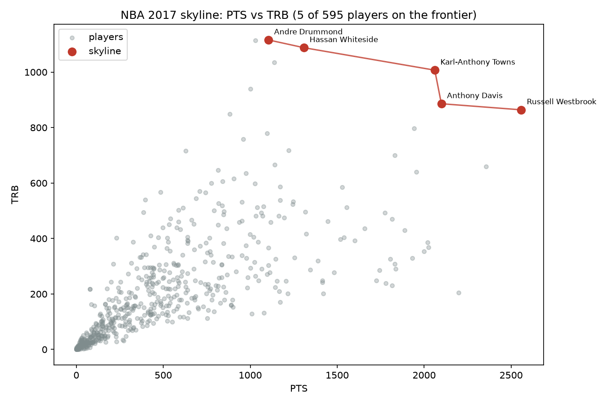
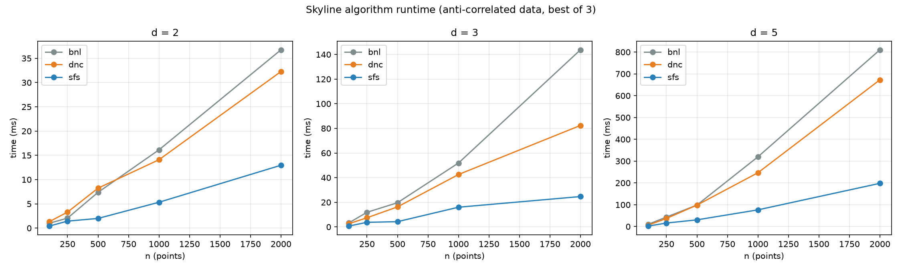

# Skyline Queries over NBA Statistics

[](https://github.com/ChristosGoulas/Skyline_queries/actions/workflows/ci.yml)
[](https://www.python.org/)
[](LICENSE)

Find the **skyline** — the set of *Pareto-optimal* players — of an NBA season.
A player is in the skyline iff **no other player is at least as good on every
selected stat and strictly better on at least one**. These are the players you
can't dismiss as strictly worse than someone else: the scorers, the rebounders,
and the well-rounded few who are strong everywhere.



In 2017, over **PTS vs TRB**, only five players made the cut: Russell Westbrook,
Anthony Davis, Karl-Anthony Towns, Hassan Whiteside, and Andre Drummond — MVP
calibre scorers and the league's elite rebounders. Everyone else is strictly
dominated.

## What's here

Three skyline algorithms with a shared, tested dominance model:

| Algorithm | Idea | Worst case | Notes |
|-----------|------|-----------|-------|
| **BNL** `bnl` | Block Nested Loop: each candidate is compared against every current skyline member | $O(n^2 d)$ | Simple, streaming-friendly |
| **SFS** `sfs` | Sort-First-Skyline: sort best-first by a monotone score, then each candidate is checked only against the skyline so far | $O(n^2 d)$ | Same bound, much faster in practice |
| **D&C** `dnc` | Divide & Conquer on the median of dim 0, merge by cross-checking the two sub-skylines | $O(n \log^{d-2} n)$, $O(n \log n)$ for $d=2$ | Best asymptotic scaling |

All three agree on every dataset — enforced by a property-style test suite that
checks them against a brute-force oracle (and against each other) over random
data and the real CSVs.

## Quickstart

```bash
# from the repo root (defaults to data/2017_ALL.csv)
python3 -m skyline --dims PTS,TRB
```

```
Skyline over ['PTS', 'TRB'] (595 players, algo=sfs)
Computed in 1.92 ms — 5 players:

  Russell Westbrook         PTS=2558  TRB=864
  Anthony Davis             PTS=2099  TRB=886
  Karl-Anthony Towns        PTS=2061  TRB=1007
  Hassan Whiteside          PTS=1309  TRB=1088
  Andre Drummond            PTS=1105  TRB=1116
```

Pick an algorithm, change dimensions, or minimize a stat (e.g. turnovers):

```bash
python3 -m skyline --dims PTS,TRB,AST --algo dnc
python3 -m skyline --dims PTS,TOV --min TOV      # maximize PTS, minimize TOV
python3 -m skyline --benchmark                   # time all algorithms + verify they agree
```

Or use it as a library:

```python
from skyline import Mode, extract_points, load_csv, sfs

dataset = load_csv("data/2017_ALL.csv")
points, players = extract_points(dataset, ["PTS", "TRB", "AST"])
skyline = sfs(points, [Mode.MAX, Mode.MAX, Mode.MAX])
```

## Benchmarks

Runtime on anti-correlated synthetic data (the skyline stress case), best of 3:



| n | d | BNL | SFS | D&C |
|---|---|-----|-----|-----|
| 500 | 2 | 7.4 ms | **2.0 ms** | 8.2 ms |
| 2000 | 2 | 36.8 ms | **13.0 ms** | 32.3 ms |
| 1000 | 5 | 319.8 ms | **76.6 ms** | 246.7 ms |
| 2000 | 5 | 810.3 ms | **198.2 ms** | 672.7 ms |

**Takeaway:** SFS wins at every size — the best-first sort means most candidates
are rejected after very few comparisons, and skyline members are never
re-examined. D&C pays a constant-factor overhead at these sizes but its
$O(n \log^{d-2} n)$ scaling wins asymptotically as $n$ and $d$ grow.

Reproduce with:

```bash
python3 benchmarks/benchmark.py     # writes benchmarks/results.csv
python3 benchmarks/make_figures.py  # writes docs/*.png  (needs matplotlib)
```

## Project layout

```
skyline/
  dominance.py    # Mode (MAX/MIN), dominates() — the core relation
  algorithms.py   # bnl, sfs, dnc
  data.py         # CSV loading + point extraction
  visualize.py    # matplotlib figures
  cli.py          # argparse front-end (python3 -m skyline)
tests/
  test_skyline.py # oracle-based correctness harness (67 tests)
benchmarks/
  benchmark.py    # runtime sweep over n and d
  make_figures.py # regenerate the README figures
data/2017_*.csv   # 2017 NBA season stats (595 players)
```

## Development

```bash
# isolated env (system Python is externally managed on many distros)
python3 -m venv .venv && source .venv/bin/activate
python3 -m pip install -e ".[dev,viz]"

pytest -q          # tests
ruff check .       # lint
mypy skyline benchmarks   # type check (strict)
```

CI (GitHub Actions) runs lint + type check + tests on Python 3.10–3.12.

## Notes on correctness

The test suite exists because skyline algorithms are easy to get subtly wrong.
Three real bugs it caught while building this:

* **Divide & Conquer** — duplicate first-dimension values straddling the median
  split, and a merge step that only filtered the worse half in one direction,
  both let dominated points survive.
* **BNL / SFS** — identical points never dominate each other, so duplicate rows
  accumulated in the skyline unless explicitly de-duplicated.
* **Data** — the per-stat CSVs are headerless two-column files, not the
  eight-column schema of `2017_ALL.csv`.

Duplicates are collapsed to a single copy and all algorithms return the same
set, guaranteed by the oracle tests.

## License

MIT — see [LICENSE](LICENSE).
